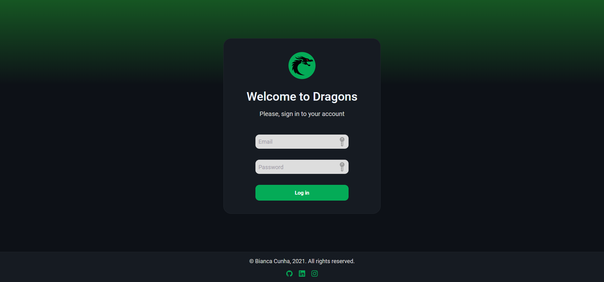
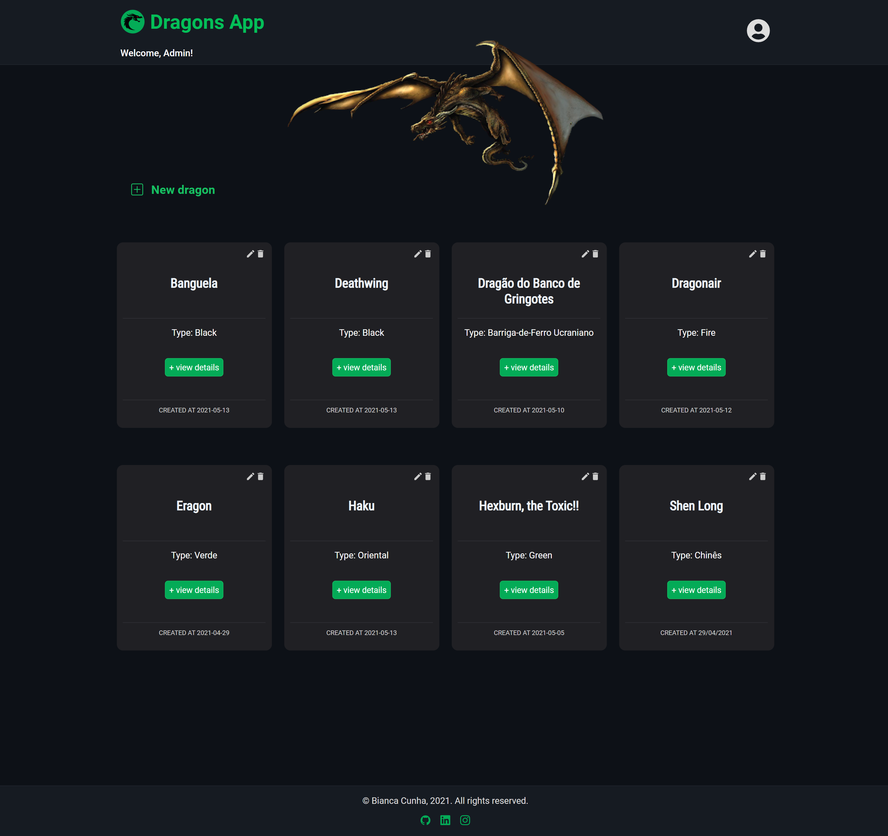

<div align="center">
  <h1>Dragons</h1>
  
  
  
  
  
</div>

**Dragons** is a front end application that consumes data from [Dragons API](http://5c4b2a47aa8ee500142b4887.mockapi.io/api/v1/dragon), and also consumes a [Login API](https://github.com/cunhasbia/login-auth-api) (developed by me) for authentication of a previously registered user in database and then access the Dragons App.

Please, go to [this login API repository](https://github.com/cunhasbia/login-auth-api) and run both projects together.

## Credentials (email & password)
Please use these credentials to be able to log in the app:

- Email: admin@admin.com
- Password: admin123

## Application preview

### Login


### Homepage


<hr> 

## Functionalities
✔️ Login page with authentication<br>
✔️ Homepage with the **dragons list** in alphabetic order<br>
✔️ Page with **dragon details** (name, type, description, etc)<br>
✔️ CRUD (create/read/update/delete a dragon)<br>
✔️ Data validation<br>
✔️ Responsiveness

## Technologies and tools used

- Javascript ES6+
- React
- Redux 
- SASS
- Sweet Alert
- React Icons

## How to run the project?

Before start, install [Git](https://git-scm.com), [Node.js](https://nodejs.org/en/) and [Yarn](https://classic.yarnpkg.com/en/docs/install/#windows-stable) on your machine. Moreover, recommend use the [VSCode](https://code.visualstudio.com/) terminal.

```bash
# Clone this repository
$ git clone https://github.com/cunhasbia/dragons-frontend.git

# Access the repository on your terminal
$ cd dragons-frontend

# Install dependencies
$ yarn

# Run the project
$ yarn start

# The app will be running on http://localhost:3000
```

Don't forget to use the [login API](https://github.com/cunhasbia/login-auth-api) to be able to authenticate yourself in this app.

---
<p align="center">Made with :orange_heart: by Bianca Cunha | Find me on <a href="https://www.linkedin.com/in/biancascunha">LinkedIn</a></p>